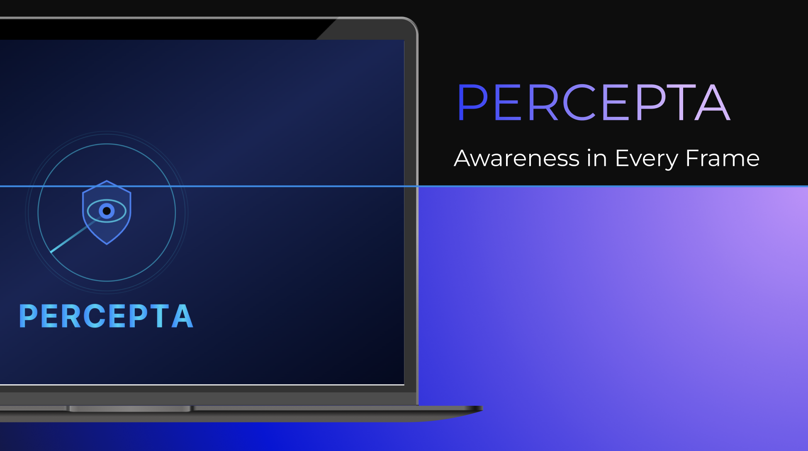

<p align="center">
  
</p>

<h1 align="center">Percepta</h1>

<p align="center">
  A real-time computer vision security system built with Python.
</p>

<p align="center">
  
  
  
  
</p>

---

## Overview

Percepta is a real-time face recognition and security monitoring system built using Python, OpenCV, and PyTorch.  

It enables:

- Face registration
- Live face detection
- Face recognition using deep embeddings
- Auto-lock when no known face is detected
- Public mode (temporary session with auto-wipe)
- Event logging

This project is designed as a modular, expandable computer vision project for security, privacy, and automation systems.
[Presentation](https://www.figma.com/deck/iwGIxZrvbIZKBx3wqq64KL/percepta?node-id=1-139&t=kur1r6K1qycawXEm-1)
---

## Features

### Face Detection
- Uses **MTCNN** for real-time face localization
- Bounding box rendering
- Multi-face support

### Face Recognition
- Embeddings generated using **InceptionResnetV1**
- Cosine similarity comparison
- Configurable similarity threshold

### Auto-Lock System
- Triggers when:
  - No face detected for a defined delay
- Integrates with OS lock mechanism

### Public Mode
- Temporary face registration
- Session-based identity
- Automatic database wipe after lock

### Local Face Database
- Embeddings stored in `.npz`
- Metadata stored in `.json`

###  Optional GUI Overlay
- Live detection feedback
- Status display
- Clean, minimal interface

---

## Tech Stack

- Python 3.11
- OpenCV
- PyTorch
- facenet-pytorch
- NumPy
- Tkinter (GUI)
- Multiprocessing
- Smalltalk
---

## Installation

### Clone Repository

```bash
git clone https://github.com/yourusername/percepta.git
cd percepta
```
### Create Virtual Environment
```bash
python3.11 -m venv venv
source venv/bin/activate  # macOS/Linux
venv\Scripts\activate     # Windows
```
### Install Dependencies
```bash
pip install -r requirements.txt
```

### Run the Project
```bash
python main.py
```
## SmallTalk
### Web-Based Event Logger

We have also developed a Smalltalk web user interface that show detailed logs on the application. We used Smalltalk (Pharo) to build a HTTP server that receives structured event data from our Python backend. Smalltalks will store those events in memory and maintain a rolling log live time. This will be documented on a personal file as well as showing the logs live in the local web interface. This allows us to monitor our app behavior without interrupting any core functions. 

To run it download the Pharo Launcher and import the `WebLogger.image` file in the repository. Once the playground shows up you can click run and the web ui will connect to the Percepta instance. The code for it is available for inspection at the `PrivacyLogger` folder. The folder is the exported package that we created and ran in the playground by 

```
logger startOn: 8080.
```

---
## Configuration
If your camera is not detected or is giving you an error please edit the `CAMERA_INDEX` varible in the `.env` file to match your needs. 
```
CAMERA_INDEX = 1
```

You can also modify the sensitivity of the model like this 

```
GAZE_THRESHOLD=0.3
SIM_THRESHOLD=0.7
AUTO_LOCK_DELAY=5
SHIELD_DELAY=0.5
```

---
## Future  Improvements
- Integration to publicly shared computers (e.g libraries computers, banks, etc.)
- Cloud sync for face database
- Mobile companion app
- Encrypted embedding storage
- Dockerized deployment
- Support for specialized hardware
---
## Disclaimer

This project is intended for educational and research purposes. Always follow privacy laws and obtain consent before collecting biometric data.

---
## Author 
- lilygia04
- oversoulmoon
